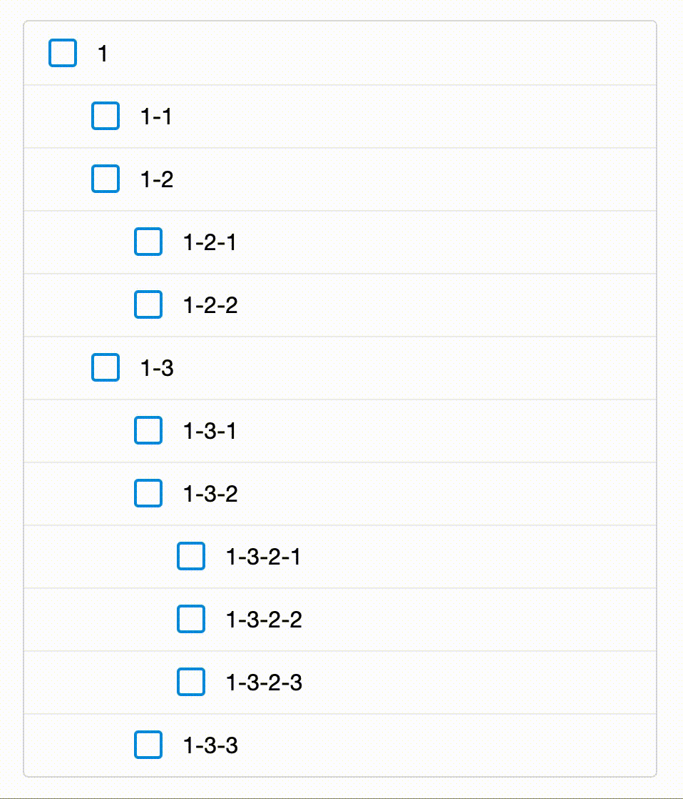

# Nested Checkbox

## 概要
ネストされたチェックボックスの連動

## Sample


```html
<ul>
    <li class="j-nestedCheckbox__group--layer1">
        <input type="checkbox" name="layer1_cd" value="1" class="j-nestedCheckbox__trigger--layer1">
        <ul>
            <li class="j-nestedCheckbox__group--layer2">
                <input type="checkbox" name="layer2_cd" value="1-1" class="j-nestedCheckbox__trigger--layer2">
            </li>
            <li class="j-nestedCheckbox__group--layer2">
                <input type="checkbox" name="layer2_cd" value="1-2" class="j-nestedCheckbox__trigger--layer2">
                <ul>
                    <li class="j-nestedCheckbox__group--layer3">
                        <input type="checkbox" name="layer3_cd" value="1-2-1" class="j-nestedCheckbox__trigger--layer3">
                    </li>
                    <li class="j-nestedCheckbox__group--layer3">
                        <input type="checkbox" name="layer3_cd" value="1-2-2" class="j-nestedCheckbox__trigger--layer3">
                    </li>
                </ul>
            </li>
        </ul>
    </li>
</ul>
```

```js
import NestedCheckbox from '../module/nestedCheckbox';

const SELECTOR = {
    NESTED: [
        // 上の階層から定義する
        {
            GROUP: '.j-nestedCheckbox__group--layer1',
            TRIGGER: '.j-nestedCheckbox__trigger--layer1',
        },
        {
            GROUP: '.j-nestedCheckbox__group--layer2',
            TRIGGER: '.j-nestedCheckbox__trigger--layer2',
        },
        {
            GROUP: '.j-nestedCheckbox__group--layer3',
            TRIGGER: '.j-nestedCheckbox__trigger--layer3',
        },
    ],
};

const nestedCheckbox = new NestedCheckbox(SELECTOR.NESTED);

nestedCheckbox.init();
```
